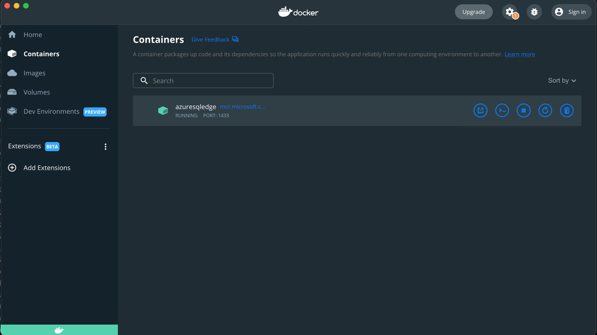
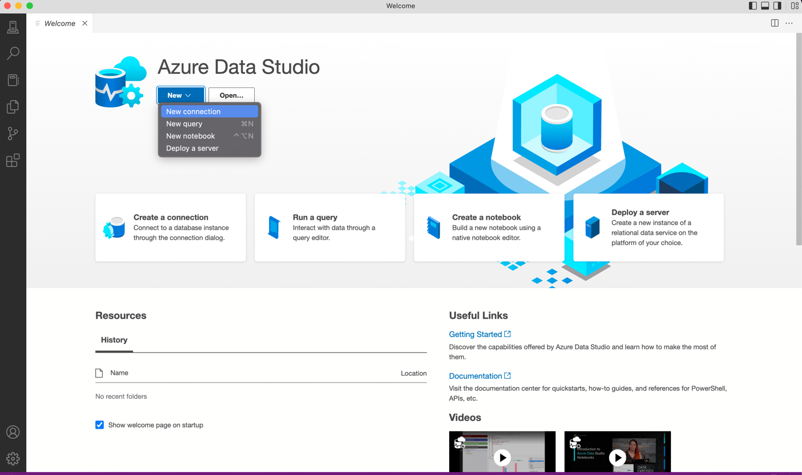
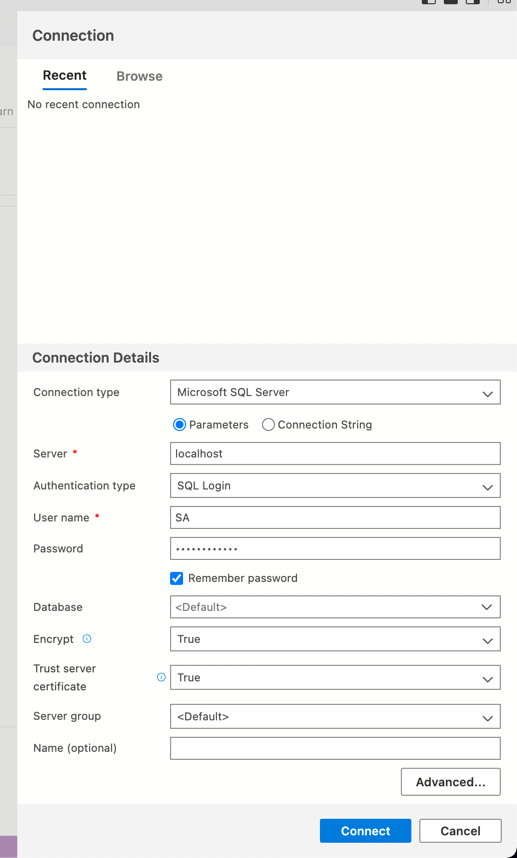
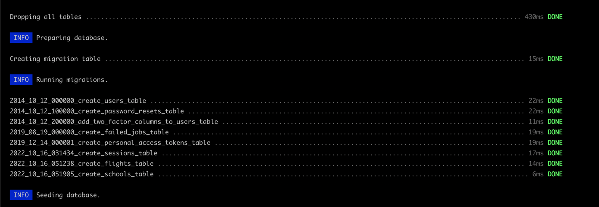

## Laravel Connecting to SQL Server, MSSQL database.

- Install [docker](https://www.docker.com) on your system
- If your MAC has M1 chip, Instead of MSSQL image for Apple M1 Chip try using "azure-sql-edge".
  - Install [Azure Data Studio](https://learn.microsoft.com/en-us/sql/azure-data-studio/download-azure-data-studio?view=sql-server-ver16)
- Try this command instead on the second step and see if it works:
```code 
docker pull mcr.microsoft.com/azure-sql-edge
```
- You have to run/set mssql username and password
```code
docker run --cap-add SYS_PTRACE -e 'ACCEPT_EULA=1' -e 'MSSQL_SA_PASSWORD=Password@123' -p 1433:1433 --name azuresqledge -d mcr.microsoft.com/azure-sql-edge
```
- After successfully complete above command, you can see azuresqledge running 🚀
  

- Go to Azure Data Studio
- Go to new connection for mssql

- Add new connection detail
  - Server: `localhost`
  - User name: `SA`
  - Password (as mentioned on above command): `Password@123`
    - Note: it must be 8 character. otherwise you can't connect it


### Last step for connect with laravel
- Set following variable in your laravel project's .env
```code 
DB_CONNECTION=sqlsrv
DB_HOST=localhost
DB_PORT=1433
DB_DATABASE=<database-name>
DB_USERNAME=SA
DB_PASSWORD="Password@123"
```
Now, you are good to go 


Thanks from [Pooja Jadav](https://github.com/PoojaJadav)
